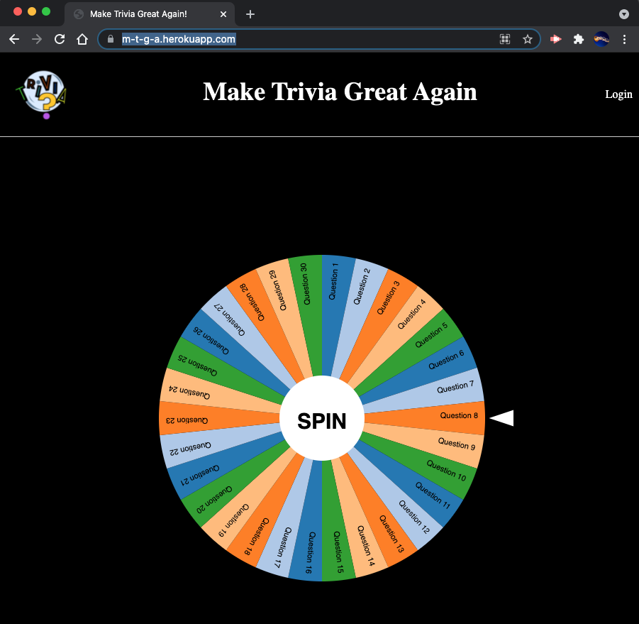
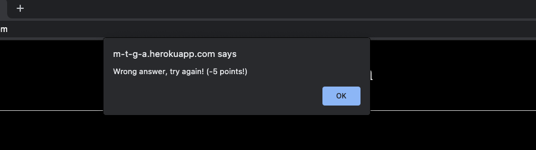
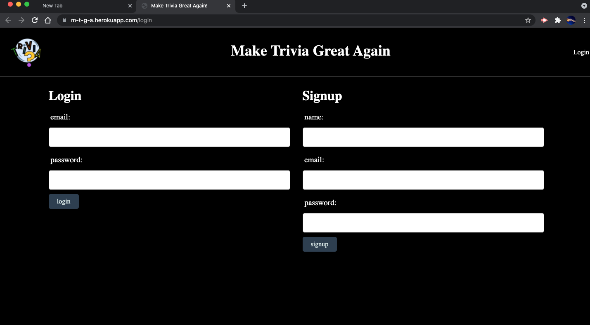

# Make-Trivia-Great-Again

## Description

Finished group project#2: Interactive Full-Stack Application

Name: Make Trivia Great Again

Make Trivia Great again is an application that allows users to spin a wheel containing thirty trivia questions of five different categories: Geography, Mythology, Science, Sports, and [insert last category here] to test their trivial knowledge.

Users will be able to login with a username, email, and password so they can save their scores and track how well they perform.

## Installation

When the user loads the page, they will be prompted to sign up with a username, email, and password of their choice so their scores can be stored so they can track and try to beat their previous scores. Once the user signs up, they will be able to start the trivia by hitting the spin button on the wheel, randomly selecting a question. Once the question is answered, if correct, the user will get a point, if incorrect, no point will be added and the user will have to spin the wheel again to receive the next question until all the questions have been attempted. A perfect score will be thirty correct answers out of thirty questions.

## Future Projects 

Users will be able to play with other players in real time, whether that is with friends (who are added by username),or in randomized serevers with other users. Scores will also be shown in real time to ensure users know where they are in a pool of players. Users will be put on a time limit that will ensure they are answering the questions within 20 seconds. 

## Problems Encountered

In the making of this project, many problems were encountered, the making of the wheel was a lot harder than it was first suspected to be, however once a wheel with the format that we needed was found we were able to incorperate it into our game with the ability to help users choose questions at random. The use of .handlebars was challenging in itself, and allowing it to communicate with a database in MySql Workbench was another obstacle. 

## Technologies Used

- HTML/CSS/Javascript
- Node.js
- Express.js
- Handlebars.js
- MySQL and the Sequelize ORM for the database.
- Heroku

### Contributors

Rondolph Dixon (Barrel), Nabiha Khan, David Rivera, and Trevor Wiegand

### Links

Github URL: https://github.com/TriviaProject/Make-Trivia-Great-Again

Heroku URL: https://m-t-g-a.herokuapp.com/

### Acknowledgments

We would also like to thank Scott Brunswig, Katy Cooney, and Nicole Wilsey Starr for their help and support throughout the process.

### Screenshots

# Here's a screenshot of the finished webpage. #

# Here's a screenshot of the answer alerts. #

# Here's a screenshot of the finished login page. #

